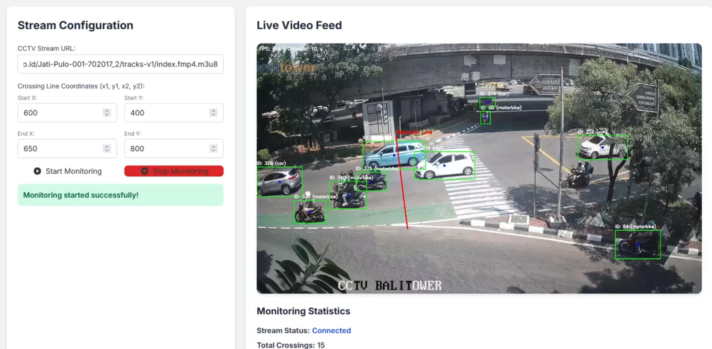

CCTV Traffic Monitor with YOLOv8 and Flask

This project implements a real-time CCTV traffic monitoring system using a Flask web application. It leverages YOLOv8 for object detection and ByteTrack for object tracking, displaying the processed video feed in a web browser. The system can detect and track vehicles, count line crossings, and provide real-time statistics.
✨ Key Features

    Real-time Video Processing: Connects to a live HLS (HTTP Live Streaming) CCTV stream.

    Object Detection: Utilizes a custom-trained YOLOv8 model (or a pre-trained one) to detect various vehicle types (car, motorbike, bicycle, bus, truck).

    Object Tracking: Employs ByteTrack to maintain consistent IDs for detected objects across frames.

    Line Crossing Detection: Configurable virtual line to count vehicles crossing in either direction.

    Web Interface: Provides a simple web page to view the annotated video feed and real-time crossing statistics.

    Dockerized Deployment: Packaged as a Docker container for easy setup and consistent environment.

    GPU Acceleration: Optimized to run on NVIDIA GPUs using PyTorch and CUDA for high-performance inference.

🚀 Technologies Used

    Backend: Python 3, Flask

    Deep Learning: PyTorch, Ultralytics YOLOv8, SuperGradients (for ByteTrack)

    Video Processing: OpenCV, FFmpeg (integrated via subprocess)

    Containerization: Docker

    GPU Acceleration: NVIDIA CUDA, cuDNN

⚙️ Setup Instructions

Follow these steps to set up and run the project.
Prerequisites

    Docker: Ensure Docker Desktop (Windows/macOS) or Docker Engine (Linux) is installed and running.

    NVIDIA Container Toolkit: If you have an NVIDIA GPU, ensure the NVIDIA Container Toolkit is installed on your host system to enable --gpus all functionality.

1. Project Structure

Ensure your project directory has the following structure:

cctv-traffic-monitor/
├── app.py
├── Dockerfile
├── requirements.txt
└── templates/
    └── index.html

    app.py: The main Flask application code.

    Dockerfile: Defines the Docker image build process.

    requirements.txt: Lists Python dependencies.

    templates/index.html: The HTML template for the web interface.

4. app.py Content (Main Application Logic)

The app.py contains the Flask application, the TrafficMonitor class for handling video processing, YOLO inference, tracking, and streaming.

Important sections to review in app.py:

    _initialize_model: This is where your YOLO model is loaded.

        If you're using a custom checkpoint (e.g., my_custom_yolo_checkpoint.pt), ensure the custom_checkpoint_path variable is set correctly.

        The DetectionModel(ch=3, nc=80) line initializes the model architecture. The nc (number of classes) parameter MUST match the number of classes your custom model was trained on. Adjust nc if your model has a different number of output classes.

    _start_ffmpeg_stream: This method configures the FFmpeg command. It includes crucial flags for live HLS streams (-re, -reconnect, -hls_flags live, -hls_playlist_reload_interval).

    generate_frames: This method now includes a target_output_fps (default 25.0) to control the video playback speed, preventing the "fast-forward" effect. Adjust this value if your CCTV stream has a different native frame rate.

    _process_detections: This method is set up to handle raw tensor output from DetectionModel and convert it to supervision.Detections. You might need to adjust the indexing (results[:, :4], results[:, 4], results[:, 5]) if your model's output tensor format is different.

🏃‍♀️ How to Run

    Build the Docker Image:
    Navigate to your cctv-traffic-monitor directory in your terminal and run:

    docker build -t cctv-monitor-tf-ngc .

    This might take some time as it downloads the base image and installs dependencies.

    Run the Docker Container:
    Once the image is built, run the container, exposing port 5000 and providing GPU access:

    docker run --gpus all -p 5000:5000 cctv-monitor-tf-ngc

    The --gpus all flag is essential for utilizing your NVIDIA GPU.

    Access the Web Interface:
    Open your web browser and go to http://localhost:5000.

🖥️ Configuration in the Web Interface

On the index.html page, you will find input fields to configure the stream:

    Stream URL: Enter the URL of your HLS CCTV stream (e.g., https://cctv.balitower.co.id/Jati-Pulo-001-702017_2/tracks-v1/index.fmp4.m3u8?timeout=20000000).

    Crossing Line Coordinates: Define the start and end points of your detection line as x1,y1,x2,y2. For example, 960,0,960,1080 for a vertical line in the middle of a 1920x1080 stream.

    Click "Start Monitoring" to begin processing.

    Click "Stop Monitoring" to stop the stream.